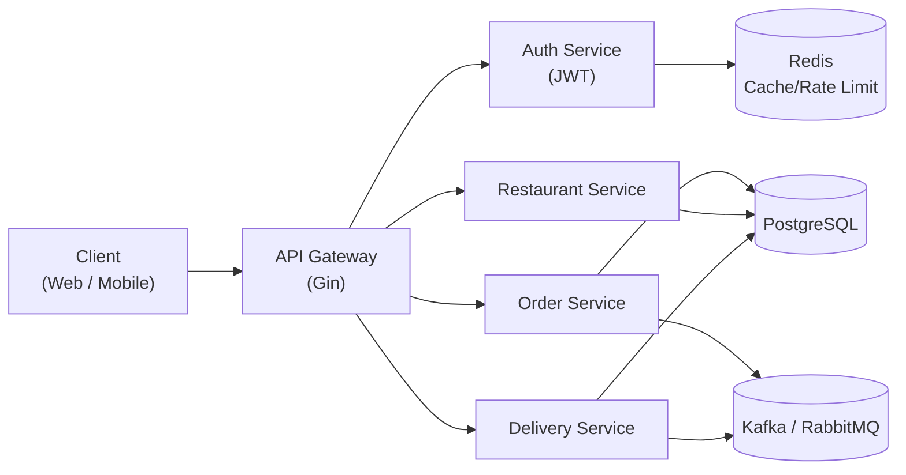

# 🍔 Restaurant Delivery System

A backend project built with **Golang**, simulating a restaurant delivery platform, just like UberEats and Foodpanda.  
This project implements and makes use of skills including RESTful API design, database schema, JWT authentication, caching, event-driven architecture, and deployment with testing.

---

## ✨ Features
- **Gin** framework for RESTful API
- **PostgreSQL** as the main relational database
- **Redis** for caching and API rate limiting
- **Kafka / RabbitMQ** for order event handling & delivery dispatch
- **JWT authentication** with role-based access control (Customer / Restaurant / Delivery / Admin)
- **Docker & Kubernetes** deployment with CI/CD pipeline
- **Unit tests & Integration tests** for reliability

---

## 🏗️ System Architecture

---

## 📚 Planned Functions

Customer: register/login, browse restaurants, place orders, track orders (real-time updates)

Restaurant Owner: manage restaurant info, menu items, handle orders

Delivery Person: accept orders, update delivery status

Admin (optional): system overview, reports & statistics