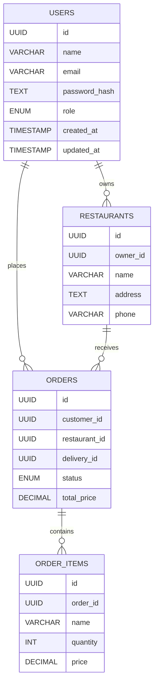

# 📘 Database Schema (ERD)

```mermaid
erDiagram
    USERS {
        UUID id
        VARCHAR name
        VARCHAR email
        TEXT password_hash
        ENUM role
        TIMESTAMP created_at
        TIMESTAMP updated_at
    }
    RESTAURANTS {
        UUID id
        UUID owner_id
        VARCHAR name
        TEXT address
        VARCHAR phone
    }
    ORDERS {
        UUID id
        UUID customer_id
        UUID restaurant_id
        UUID delivery_id
        ENUM status
        DECIMAL total_price
    }
    ORDER_ITEMS {
        UUID id
        UUID order_id
        VARCHAR name
        INT quantity
        DECIMAL price
    }

    USERS ||--o{ RESTAURANTS : owns
    USERS ||--o{ ORDERS : places
    RESTAURANTS ||--o{ ORDERS : receives
    ORDERS ||--o{ ORDER_ITEMS : contains
```
